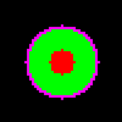

# Next-Best-Cell Frontier Exploration Algorithm for a USV

Frontier-based exploration guides an autonomous surface vehicle (USV) toward the boundary between known free space and unexplored terrain. A **frontier cell** is any free cell adjacent to at least one unknown cell. By repeatedly selecting such frontiers, the USV incrementally uncovers the environment until no frontiers remain.

By definition, a **frontier cell** is any free (known-empty) cell adjacent to at least one unknown cell, and a **frontier region** (cluster) is a set of frontier cells adjacent to each other. In the figure, frontier cells form a ring around the explored area; moving towards any of them would allow the USV to uncover new territory beyond the current map.

## Frontier Detection

1. **Occupancy Graph**: A 500×500×2 array `graph`, where each cell `(i,j)` has:
   - `graph[i,j,0]`: count of times observed as occupied
   - `graph[i,j,1]`: total observation count
2. **Known vs Unknown**: A cell is **unknown** if `graph[i,j,1] == 0`; otherwise it is **known**.
3. **Occupancy Probability**: for known cells: `occ_prob = graph[i,j,0] / graph[i,j,1]`
4. **Free Cells**: Known cells with `occ_prob < free_threshold` are treated as traversable.
5. **Frontier Mask**: A free cell is a frontier if any of its 8 neighbors is unknown.

## Frontier Clustering

Frontier cells are grouped into connected regions (8-connectivity). Each **cluster** represents a contiguous boundary of unexplored space. Clustering prevents selecting multiple nearby frontier cells and instead treats each boundary segment as a single target.

## Utility Function

For each frontier cluster, compute:

- **Information Gain** (G): number of cells in the cluster
- **Distance Cost** (D): Euclidean distance from current pose to the cluster centroid
- **Turning Cost** (Δθ): absolute heading change needed to face the centroid

Combine into a utility score: `U = G - λ * (D + θ_weight * |Δθ|)`

- **λ** (`lambda_coeff`): trade-off weight between gain and cost
- **θ_weight** (`theta_weight`): penalty weight for turning angle

The cluster with the highest **U** is selected; its centroid (or the nearest frontier cell to the centroid) becomes the next goal.

I recommend reading Dr. Yamauchi's [A Frontier-Based Approach for Autonomous Exploration](yamauchi_frontiers.pdf) to understand the logic behind this algorithm.

## Configuration & Performance

Adjustable parameters at the top of the implementation:

- `lambda_coeff`: higher ⇒ favors closer frontiers; lower ⇒ favors larger frontiers
- `theta_weight`: relative cost of turning vs. moving straight
- `free_threshold`: occupancy probability cutoff for free cells
- `debug_mode`: if `true`, returns utility breakdown alongside the best cell
- `max_runtime_ms`: target computation time per update (e.g., 100 ms for 10 Hz operation)

The algorithm uses efficient NumPy operations for grid processing and BFS (or optimized labeling) for clustering. On typical student-grade hardware, it should comfortably run under the specified time budget.

## Usage

1. Call `select_next_frontier(pose, graph, lambda_coeff, theta_weight, free_threshold, debug_mode)`
2. Receive either a single `(i, j)` goal or, in debug mode, a tuple `(goal_cell, info_dict)` with:
   - `info_dict['utility']`
   - `info_dict['gain']`
   - `info_dict['distance_cost']`
   - `info_dict['turning_cost']`
   - `info_dict['elapsed_ms']`
3. Pass the goal cell to a path planner for trajectory generation.